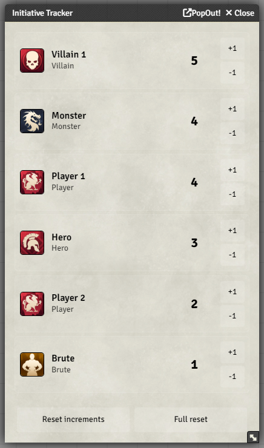
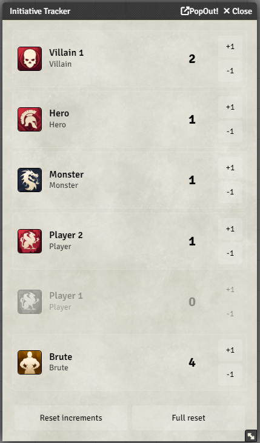
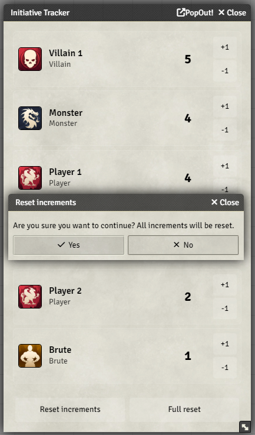
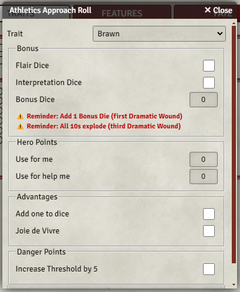
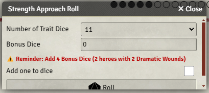
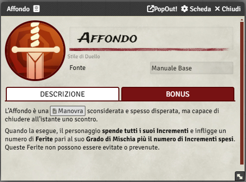
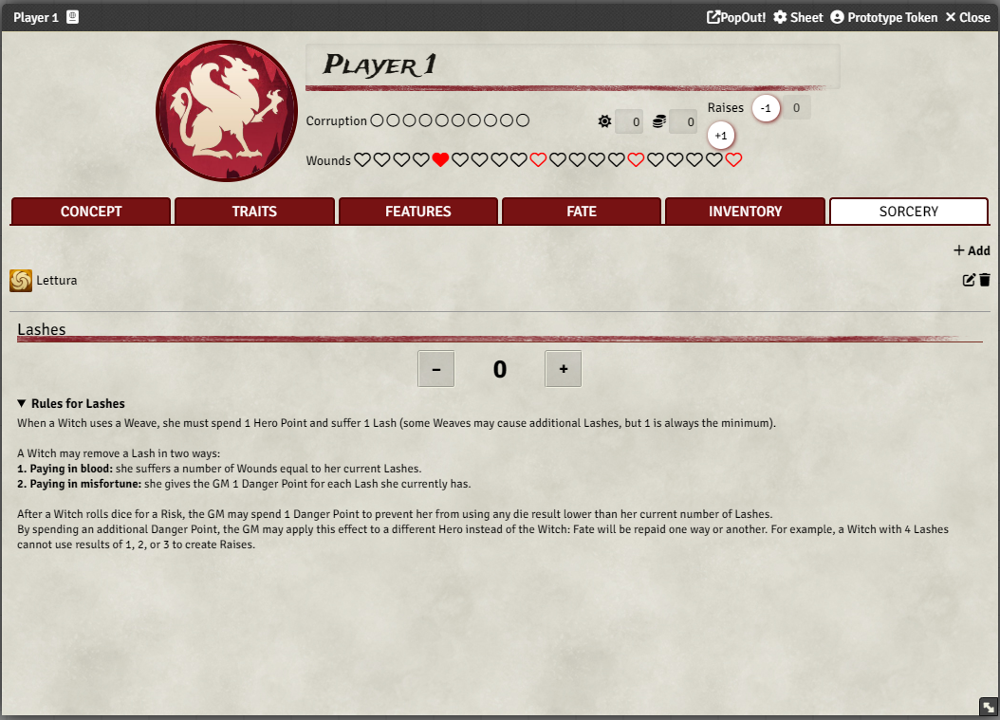

# 7th Sea quality of life improvments - FoundryVTT

A lightweight and modular Quality of Life (QoL) enhancement module for the **7th Sea Second Edition** system on Foundry VTT.  
This project focuses on improving usability, streamlining gameplay, and adding non‑intrusive helpers that respect the original rules and design.

---

## Features

### **Initiative Tracker**
A custom, resizable, and draggable initiative tracker designed around 7th Sea’s Raise‑based action economy.

- Track **Player Characters**, **Heroes**, **Villains**, **Monsters**, and **Brutes**
- Add actors via drag‑and‑drop from the sidebar or sheets
- Modify initiative values with +1 / −1 buttons
- Automatic sorting (non‑Brutes first, Brutes last)
- Reset options:
- Fully localized UI

    

### **Chat Integration for Initiative**
The module wires the “Add to Initiative” button in roll messages directly into the tracker logic.

- Uses the actor and raise data embedded in the chat card
- Automatically refreshes the tracker when a tracked actor is updated
- Localizable notification messages

### **Dramatic Wounds Helpers**
The module provides small but impactful helpers around **Dramatic Wounds**, aimed at clarity rather than automation overload.

- Visual and/or structural support for tracking Dramatic Wounds on relevant actors
- Consistent access to Dramatic Wound state during scenes
- Designed to complement, not replace, the GM’s narrative control

   

  

### **Villain Skill Rank Helper**
A small but extremely useful enhancement for Villain sheets.
The module automatically displays the Skill Rank derived from the Villain’s Strength
No data is modified on the actor

- Fully localized
- Can be enabled/disabled from module settings
- Updates automatically when the sheet is rendered

  

### **Enhanced Description Rendering (UUID Links & Inline Rolls)**
The 7th Sea 2E system does not enrich item descriptions by default, meaning UUID links and inline rolls appear as plain text.
This module adds a safe, non‑intrusive enhancement layer that:

- Converts @UUID[…] references into clickable links
- Enables inline rolls ([[1d10]]) inside item descriptions
- Preserves TinyMCE editing
- Does not alter stored data
- Works on all item types

This dramatically improves cross‑referencing between rules, notes, advantages, sorcery, and custom content.

  

### **Sorte Lashes Helper**
A dedicated quality‑of‑life enhancement for Vodacce Strega characters using the Sorte sorcery.
When an actor possesses at least one Sorcery item with sorctype: "sorte" and is of type Player Character or Hero, the module automatically adds a compact and intuitive Lashes tracker to the Sorcery tab of the actor sheet.

- Large, accessible +1 / –1 counter
- Includes an expandable rules summary describing how Lashes work in 7th Sea 2E
- Non‑intrusive: appears only for characters who actually use Sorte
- Designed to complement the GM’s narrative control without automating consequences

### **Advancements tracker**
Add a dedicated form to track acts and player advancements

### **Localization Support**
All module strings are fully localizable.  
Currently supported:

- **English**
- **Italian**
- **French**
- **Spanish**
- **German**

---

## Installation

Paste this URL into Foundry’s “Install Module” dialog: 
[http://github.com/LuckyFrico/7thsea-qol/releases/latest/download/module.json](https://github.com/LuckyFrico/7thsea-qol/releases/latest/download/module.json)

## Compatibility
Foundry VTT: 

---

System: 
[7th Sea Second Edition (Unofficial)](https://foundryvtt.com/packages/svnsea2e)
